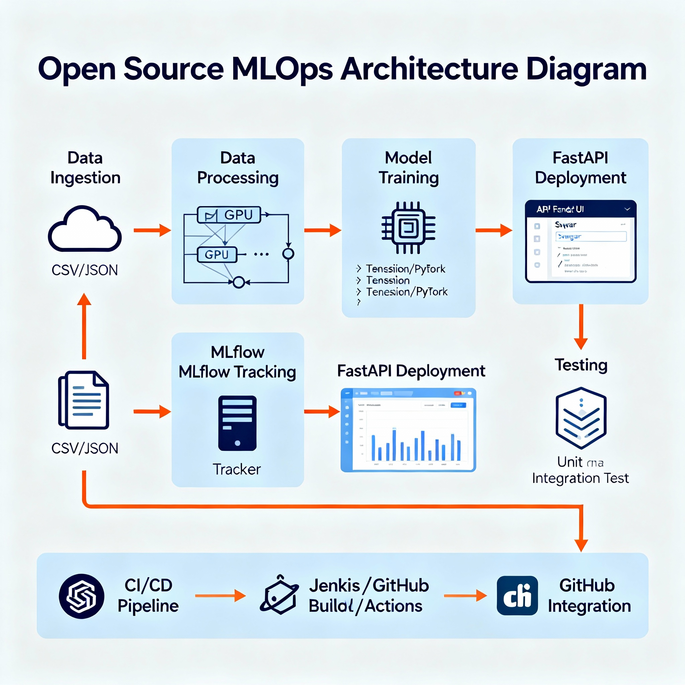

# Enterprise MLOps Pipeline Overview

## Pipeline Summary

| Step | Component | Description | Tools |
|------|------------|-------------|--------|
| 1 | Data Loader | Reads and preprocesses raw data | pandas, pyarrow |
| 2 | Model Training | Trains and serializes model | scikit-learn |
| 3 | Evaluation | Computes metrics and saves JSON | numpy, sklearn.metrics |
| 4 | Tracking | Registers experiments | MLflow |
| 5 | Deployment | Serves predictions | FastAPI, Uvicorn |
| 6 | CI/CD | Tests and validates build | pytest |

